<h2 align="center">Hi there, <a href="https://github.com/SidorovaMaria" title="Profile">I'm Maria</a> 👋</h2>
 

  I'm a Front-End Developer with a background in Computer Science & Mathematics.  
  I’m passionate about writing clean, accessible code and turning thoughtful designs into  
  responsive, user-friendly applications. My focus is on blending logic and creativity—  
  building projects that are as functional as they are visually engaging.  
   
  I thrive when I get to break down complex ideas into small, precise steps and bring them  
  together into polished, well-structured solutions. Whether it’s setting up state management  
  with Redux, designing fluid animations with GSAP, or experimenting with the latest features  
  in Next.js and Tailwind, I love the process of constant discovery and improvement.  
   
  Outside of coding, I’m passionate about fitness, design, and all things detail-oriented.  
  I enjoy challenging myself, learning continuously, and applying that mindset both in tech  
  and in life.  
   
  📚 Currently exploring: Next.js 15, Tailwind v4, and advanced UI/UX patterns  
  ✨ Fun fact: I have a dance and fitness background that keeps me creative and disciplined  
   
  📫 Let’s connect:

  <a href="https://www.linkedin.com/in/maria-sidorova-25a365210/" style="display:flex; align-items:center; gap:5px; text-decoration:none; color:inherit; font-weight:800;">
    
    LinkedIn
  </a>
  <a href="mailto:sidmashav@icloud.com" style="display:flex; align-items:center; gap:5px; text-decoration:none; color:inherit; font-weight:800;">
    
    Email
  </a>

 

<h2 align="center">🚀 Languages & Tools</h2>
<h3 align="center">Front-End</h3>
<table align="center" style='
  border-spacing: 15px; 
  border-collapse: separate;
  margin-left: auto; 
  margin-right: auto;'>
<tr>
 <td align="center" height="70" width="70"style='background-color:#cccccc30; border-radius:8px; padding:5px;'>
      
       HTML5
    </td>
 <td align="center" height="70" width="70"style='background-color:#cccccc30; border-radius:8px; padding:5px;'>
      
       CSS3
    </td>
 <td align="center" height="70" width="70"style='background-color:#cccccc30; border-radius:8px; padding:5px;'>
      
       Tailwind CSS
    </td>
 <td align="center" height="70" width="70"style='background-color:#cccccc30; border-radius:8px; padding:5px;'>
      
       JavaScript
    </td>
     <td align="center" height="70" width="70"style='background-color:#cccccc30; border-radius:8px; padding:5px;'>
      
       TypeScript
    </td>
    </tr>
    <tr>
     <td align="center" height="70" width="70"style='background-color:#cccccc30; border-radius:8px; padding:5px;'>
      
       React
    </td>
     <td align="center" height="70" width="70"style='background-color:#cccccc30; border-radius:8px; padding:5px;'>
      
       Next.js
    </td>
    <td align="center" height="70" width="70"style='background-color:#cccccc30; border-radius:8px; padding:5px;'>
      
       Redux
    </td><td align="center" height="70" width="70" style='background-color:#cccccc30; border-radius:8px; padding:5px;'>
      
       Framer Motion
    </td>
</tr>
</table>

<h3 align="center">Back-End</h3>
<table align="center" style='
  border-spacing: 15px; 
  border-collapse: separate;
  margin-left: auto; 
  margin-right: auto;'>
<tr>
 <td align="center" height="70" width="70" style='background-color:#cccccc30; border-radius:8px; padding:5px;'>
      
       Node.js
    </td>
    <td align="center" height="70" width="70" style='background-color:#cccccc30; border-radius:8px; padding:5px;'>
      
       Express.js
    </td>
<td align="center" height="70" width="70" style='background-color:#cccccc30; border-radius:8px; padding:5px;'>
      
       MongoDB
    </td>
     <td align="center" height="70" width="70" style='background-color:#cccccc30; border-radius:8px; padding:5px;'>
      
       SQL Basics
    </td>
    </td>
     <td align="center" height="70" width="70" style='background-color:#cccccc30; border-radius:8px; padding:5px;'>
      
       Sanity & GROQ
    </td> 
    </tr>
</table>

<h3 align="center">Tools & Workflow</h3>
<table align="center" style='
  border-spacing: 15px; 
  border-collapse: separate;
  margin-left: auto; 
  margin-right: auto;'>
<tr>
  <td align="center" height="70" width="70" style='background-color:#cccccc30; border-radius:8px; padding:5px;'>
      
       Git & GitHub
    </td>
    <td align="center" height="70" width="70" style='background-color:#cccccc30; border-radius:8px; padding:5px;'>
      
       Figma
    </td>
     <td align="center" height="70" width="70" style='background-color:#cccccc30; border-radius:8px; padding:5px;'>
      
       Webpack
    </td>
     <td align="center" height="70" width="70" style='background-color:#cccccc30; border-radius:8px; padding:5px;'>
      
       ViteJs
    </td>
    <td align="center" height="70" width="70" style='background-color:#cccccc30; border-radius:8px; padding:5px;'>
      
       Vitest
    </td>
     <td align="center" height="70" width="70" style='background-color:#cccccc30; border-radius:8px; padding:5px;'>
      
       Eslint & Prettier
    </td>
     <td align="center" height="70" width="70" style='background-color:#cccccc30; border-radius:8px; padding:5px;'>
      
       Vercel
    </td>
    </tr>
</table>
<!-- <h1 align="center" style='margin-top:60px'>Curently Wortking On </h1>
<h3 align='center'> <a href="https://motion-playground-one.vercel.app/"  style="text-decoration:none; color:white; font-weight:800; display:flex; align-items:center; gap:10px; justify-content:center; background-color:#fffefe4d; padding:10px; border-radius:8px;">
    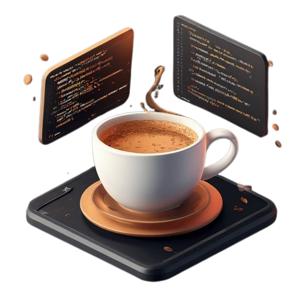
    Motion Animation Playground and learning Website↗
  </a>
  </h3>
  
An approachable React + Motion.dev docs site with interactive playgrounds

  <table align="center">
  <tr >
  <td>
  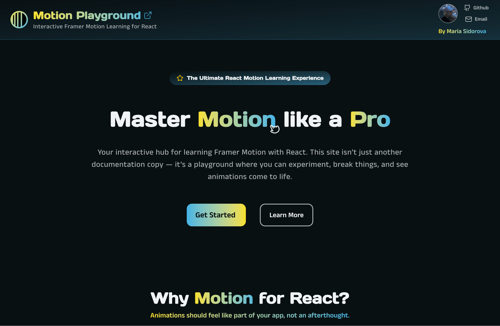
</td>
 <td>
  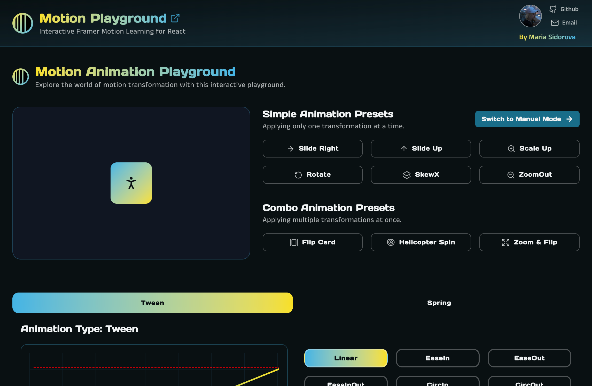
</td>
</tr>
</table> -->
<h1 align="center" style='margin-top:60px'>Projects</h1>
<h3 align='center'> <a href="https://maria-sidorova-dev.vercel.app//"  style="text-decoration:none; color:white; font-weight:800; display:flex; align-items:center; gap:10px; justify-content:center; background-color:#fffefe4d; padding:10px; border-radius:8px;">
    
    My Portfolio ↗
  </a>
  </h3>
  <table align="center">
  <tr>
  <td>
  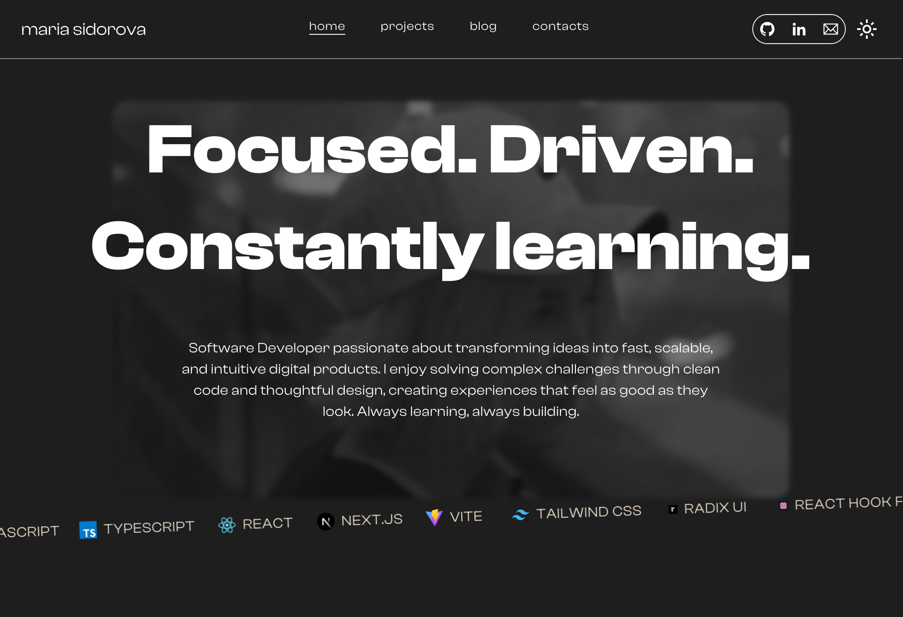
</td>
 <td>
  
</td>
</tr>
</table>
 
<h2 align="center">💰 Bookmark - Manager</h2>

  Bookmark Manager is a full-stack web app built to help users collect, categorize, and quickly access websites they love. It provides a clean interface for managing bookmarks, with tagging, searching, filtering, and archiving capabilities — all wrapped in a minimal design that adapts across screen sizes.

<table align="center">
  <tr>
    <td>
      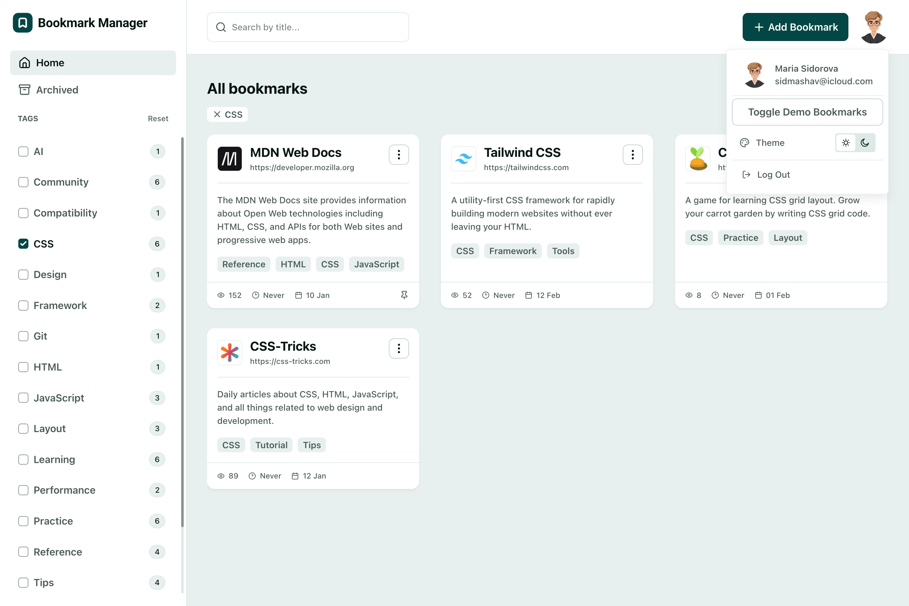
    </td>
    <td>
      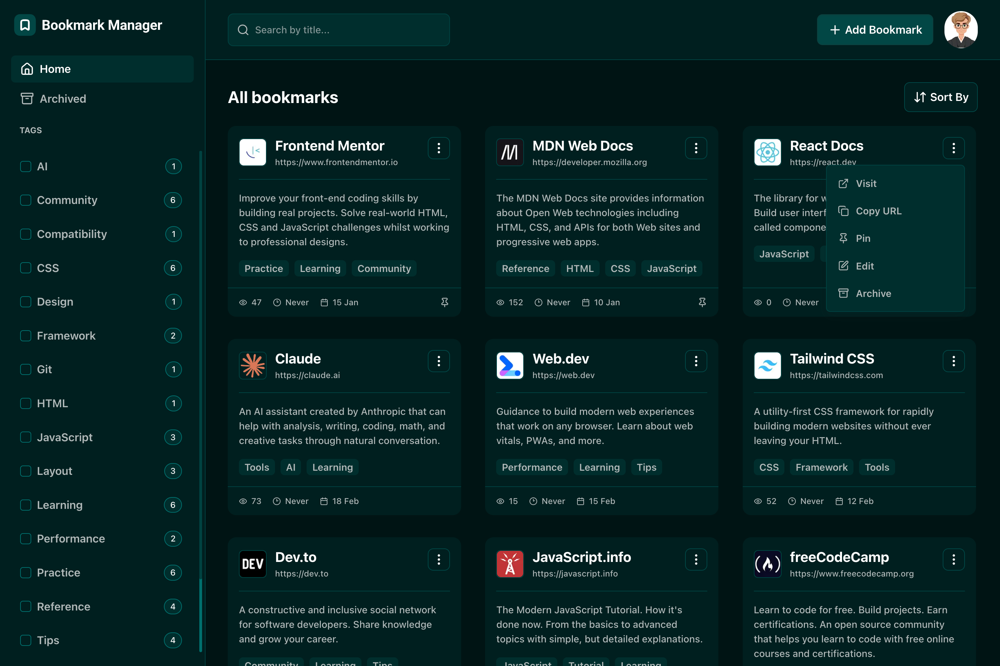
    </td>
  </tr>
</table>
 

  <a href="https://github.com/SidorovaMaria/bookmark-manager" target="_blank" style="text-decoration:none; color:inherit; font-weight:600; margin-right:20px;">
     Repository
  </a>
  <a href="https://bookmark-manager-gamma-nine.vercel.app/" target="_blank" style="text-decoration:none; color:inherit; font-weight:600;">
     Live Demo
  </a>

  <strong>Next.js · React · TypeScript · React Hook Form · Tailwind CSS · Radix UI · MongoDB · Mongoose · Vitest · Zod · Vercel</strong>

<table>
<tr>
    <td width="50%">
      <h2 align="center">💰 Finance – Budget Tracker</h2>
      

        A personal finance and budget tracker that helps users manage income, expenses, and savings.
        Features include transaction tracking, budget creation, and savings pots for specific goals — all
        within a clean and intuitive interface.
      

      

        <a href="https://budget-tracker-finance.vercel.app/" target="_blank">
          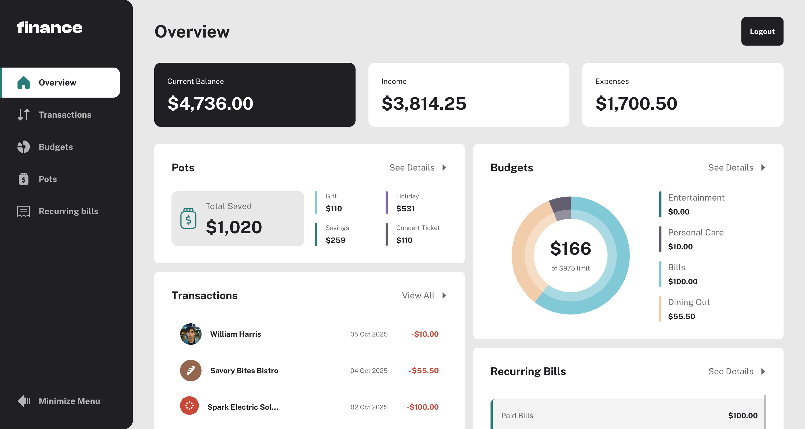
        </a>
          
        

          <a href="https://github.com/SidorovaMaria/budget_tracker" target="_blank" style="text-decoration:none; color:inherit; font-weight:600; margin-right:20px;">
             Repository
          </a>
          <a href="https://budget-tracker-finance.vercel.app/" target="_blank" style="text-decoration:none; color:inherit; font-weight:600;">
             Live Demo
          </a>
        

        

          <strong>Next.js · React · TypeScript · Tailwind CSS · Radix UI · MongoDB · Mongoose · NextAuth.js · Zod · Vercel</strong>
        

      

    </td>
    <td width="50%">
      <h2 align="center">🎨 Canvo – Figma Clone</h2>
      

        Canvo is a lightweight Figma-style design tool featuring real-time collaboration, allowing multiple users to create and edit designs together on a shared canvas. Built for speed, simplicity, and creativity.
      

      

        <a href="https://figma-clone-iota-five.vercel.app/" target="_blank">
          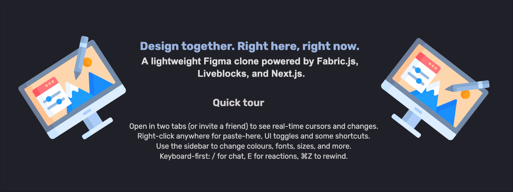
        </a>
          
        

          <a href="https://github.com/SidorovaMaria/figma-clone" target="_blank" style="text-decoration:none; color:inherit; font-weight:600; margin-right:20px;">
             Repository
          </a>
          <a href="https://figma-clone-iota-five.vercel.app/" target="_blank" style="text-decoration:none; color:inherit; font-weight:600;">
             Live Demo
          </a>
        

        

          <strong>Next.js · React · TypeScript · Tailwind CSS · Radix UI · Framer Motion · MongoDB · Mongoose · Recharts</strong>
        

      

    </td>
  </tr>
  <tr>
    <td width="50%">
      <h2 align="center">🗂️ KanBan – Task Management App</h2>
      

        KanBan is a modern task management web app that helps users organize projects visually with customizable boards and columns. It supports dynamic task tracking, smooth animations, and collaborative workflow management.
      

      

      <a href="https://portfolio-flax-pi-68.vercel.app/" target="_blank">
        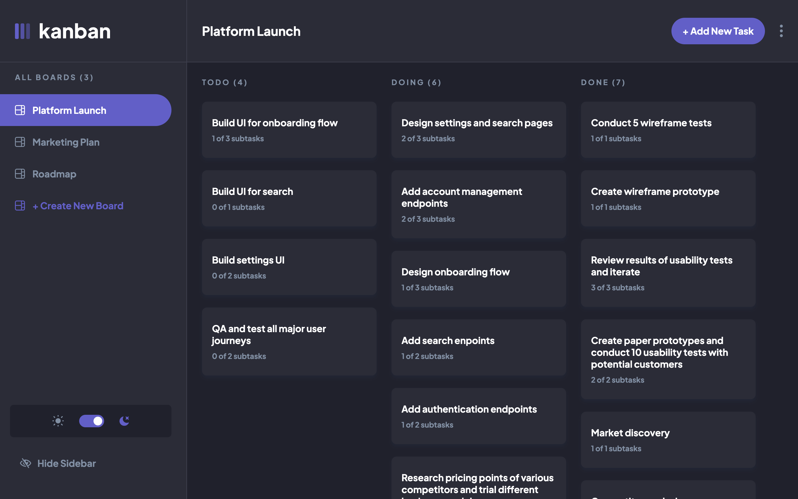
      </a>
        
      

        <a href="https://github.com/SidorovaMaria/Portfolio/tree/main/kanban-task" target="_blank" style="text-decoration:none; color:inherit; font-weight:600; margin-right:20px;">
           Repository
        </a>
        <a href="https://portfolio-flax-pi-68.vercel.app/" target="_blank" style="text-decoration:none; color:inherit; font-weight:600;">
           Live Demo
        </a>
      

      

        <strong>React · Redux · JavaScript · Node.js · Tailwind CSS · Yup</strong>
      

    

    </td>
    <td width="50%">
      <h2 align="center">📝 Notes – Note-Taking App</h2>
      

        Notes is a minimalist note-taking web app for creating, editing, and organizing personal notes. It features smooth animations, tag management, and a clean responsive interface designed for focus and simplicity.
      

      

        <a href="https://notes-delta-blue.vercel.app/" target="_blank">
          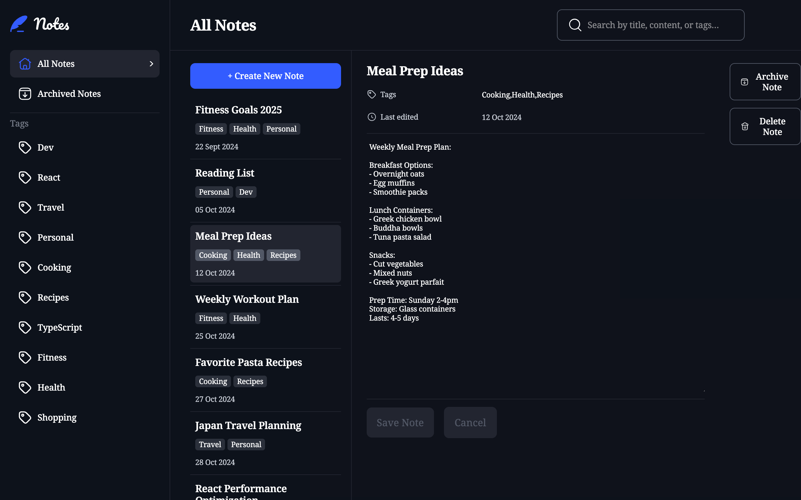
        </a>
          
        

          <a href="https://github.com/SidorovaMaria/Portfolio/tree/main/notes" target="_blank" style="text-decoration:none; color:inherit; font-weight:600; margin-right:20px;">
             Repository
          </a>
          <a href="https://notes-delta-blue.vercel.app/" target="_blank" style="text-decoration:none; color:inherit; font-weight:600;">
             Live Demo
          </a>
        

        

          <strong>React · Redux · JavaScript · Node.js · Tailwind CSS · Yup · Framer Motion</strong>
        

      

    </td>
  </tr>
  <tr>
    <td width="50%">
      <h2 align="center">🚢 Sonar Strike – Battleship Game</h2>
      

        Sonar Strike is a web-based Battleship game where players engage in a strategic naval duel against AI.
        Place your fleet, anticipate your opponent’s moves, and use logic and intuition to locate and destroy enemy ships.
      

      

        <a href="https://htmlpreview.github.io/?https://github.com/SidorovaMaria/Odin-Project/blob/sonar-strike/index.html" target="_blank">
          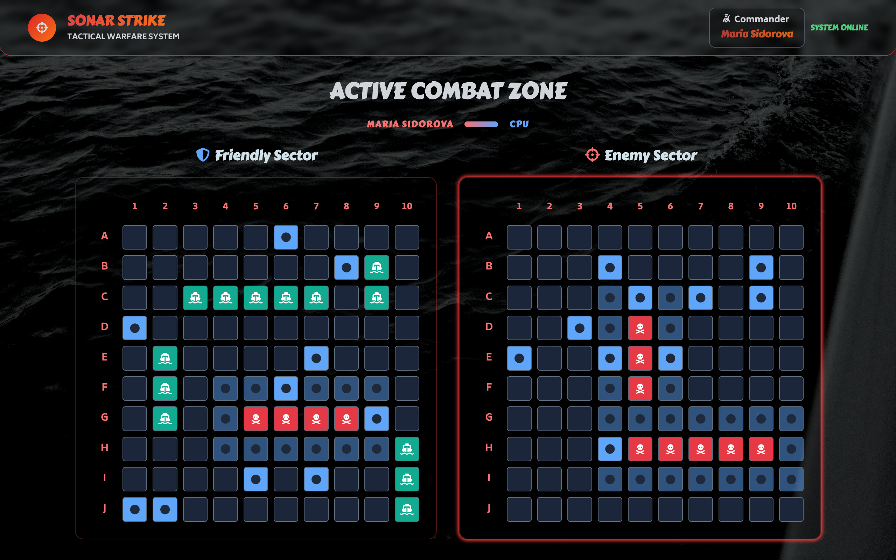
        </a>
          
        

          <a href="https://github.com/SidorovaMaria/Odin-Project/tree/main/JavaScript/SonarStrike" target="_blank" style="text-decoration:none; color:inherit; font-weight:600; margin-right:20px;">
             Repository
          </a>
          <a href="https://htmlpreview.github.io/?https://github.com/SidorovaMaria/Odin-Project/blob/sonar-strike/index.html" target="_blank" style="text-decoration:none; color:inherit; font-weight:600;">
             Live Demo
          </a>
        

        

          <strong>JavaScript · HTML · CSS</strong>
        

      

    </td>
    <td width="50%">
      <h2 align="center">🥗 MoodBowl – Meal & Mood Tracker</h2>
      

        MoodBowl helps users track their meals and moods to uncover patterns between nutrition and emotional well-being.
        Featuring a clean, intuitive interface with animated charts and smooth transitions, it promotes mindful eating and balanced daily habits.
      

      

        <a href="https://mood-bowl.vercel.app/" target="_blank">
          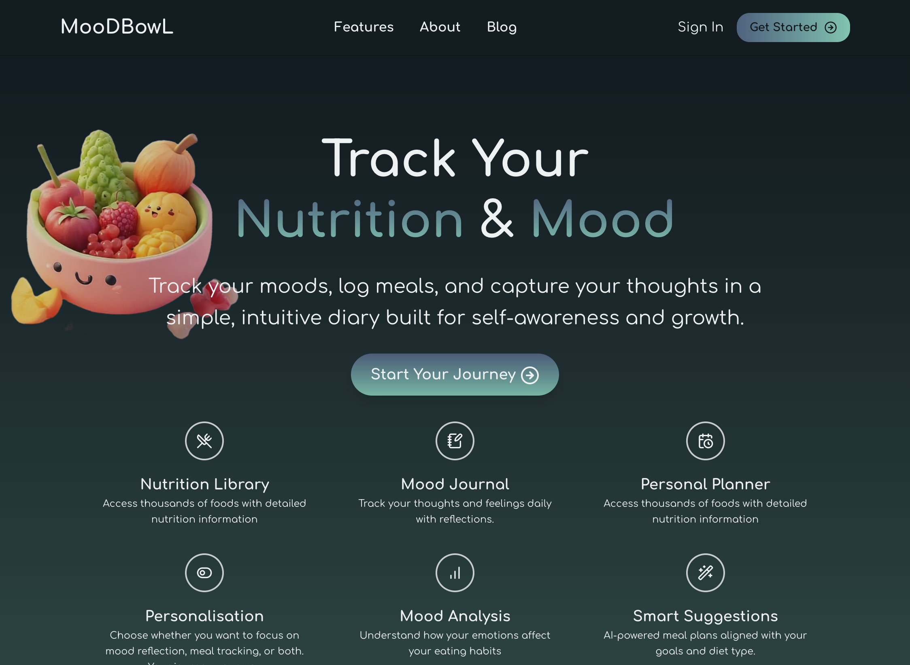
        </a>
          
        

          <a href="https://github.com/SidorovaMaria/mood-bowl" target="_blank" style="text-decoration:none; color:inherit; font-weight:600; margin-right:20px;">
             Repository
          </a>
          <a href="https://mood-bowl.vercel.app/" target="_blank" style="text-decoration:none; color:inherit; font-weight:600;">
             Live Demo
          </a>
        

        

          <strong>Next.js · React · TypeScript · Tailwind CSS · Radix UI · Framer Motion · MongoDB · Mongoose · Recharts</strong>
        

      

    </td>
  </tr>
  
</table>
