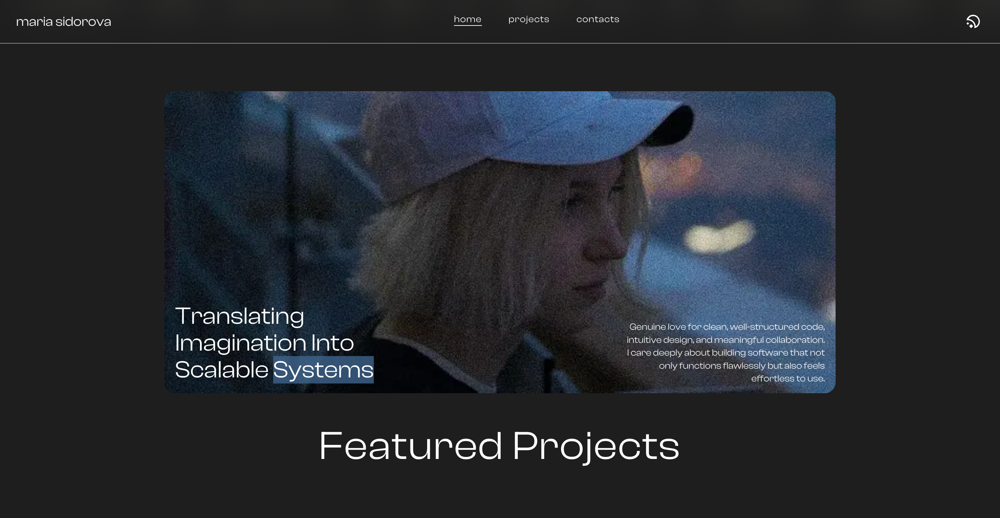
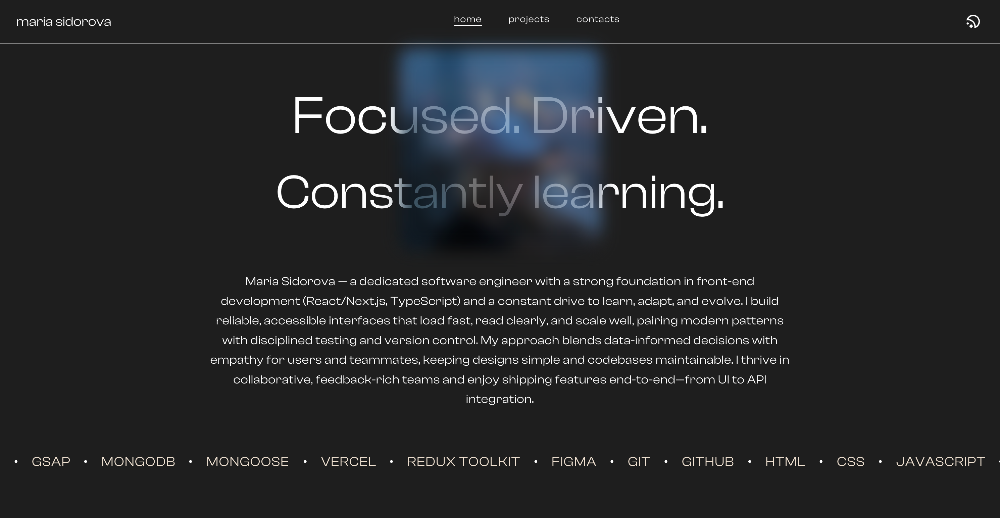

<h2 align="center">Hi there, <a href="https://github.com/SidorovaMaria" title="Profile">I'm Maria</a> 👋</h2>
 

  I'm a Front-End Developer with a background in Computer Science & Mathematics.  
  I’m passionate about writing clean, accessible code and turning thoughtful designs into  
  responsive, user-friendly applications. My focus is on blending logic and creativity—  
  building projects that are as functional as they are visually engaging.  
   
  I thrive when I get to break down complex ideas into small, precise steps and bring them  
  together into polished, well-structured solutions. Whether it’s setting up state management  
  with Redux, designing fluid animations with GSAP, or experimenting with the latest features  
  in Next.js and Tailwind, I love the process of constant discovery and improvement.  
   
  Outside of coding, I’m passionate about fitness, design, and all things detail-oriented.  
  I enjoy challenging myself, learning continuously, and applying that mindset both in tech  
  and in life.  
   
  📚 Currently exploring: Next.js 15, Tailwind v4, and advanced UI/UX patterns  
  ✨ Fun fact: I have a dance and fitness background that keeps me creative and disciplined  
   
  📫 Let’s connect:

  <a href="https://www.linkedin.com/in/maria-sidorova-25a365210/" style="display:flex; align-items:center; gap:5px; text-decoration:none; color:inherit; font-weight:800;">
    
    LinkedIn
  </a>
  <a href="mailto:sidmashav@icloud.com" style="display:flex; align-items:center; gap:5px; text-decoration:none; color:inherit; font-weight:800;">
    
    Email
  </a>

 

<h2 align="center">🚀 Languages & Tools</h2>

<h3 align="center">Front-End</h3>
<table align="center" style='
  border-spacing: 15px; 
  border-collapse: separate;
  margin-left: auto; 
  margin-right: auto;'>
<tr>
 <td align="center" height="70" width="70"style='background-color:#cccccc30; border-radius:8px; padding:5px;'>
      
       HTML5
    </td>
 <td align="center" height="70" width="70"style='background-color:#cccccc30; border-radius:8px; padding:5px;'>
      
       CSS3
    </td>
 <td align="center" height="70" width="70"style='background-color:#cccccc30; border-radius:8px; padding:5px;'>
      
       Tailwind CSS
    </td>
 <td align="center" height="70" width="70"style='background-color:#cccccc30; border-radius:8px; padding:5px;'>
      
       JavaScript
    </td>
     <td align="center" height="70" width="70"style='background-color:#cccccc30; border-radius:8px; padding:5px;'>
      
       TypeScript
    </td>
    </tr>
    <tr>
     <td align="center" height="70" width="70"style='background-color:#cccccc30; border-radius:8px; padding:5px;'>
      
       React
    </td>
     <td align="center" height="70" width="70"style='background-color:#cccccc30; border-radius:8px; padding:5px;'>
      
       Next.js
    </td>
    <td align="center" height="70" width="70"style='background-color:#cccccc30; border-radius:8px; padding:5px;'>
      
       Redux
    </td><td align="center" height="70" width="70" style='background-color:#cccccc30; border-radius:8px; padding:5px;'>
      
       Framer Motion
    </td>
</tr>
</table>

<h3 align="center">Back-End</h3>
<table align="center" style='
  border-spacing: 15px; 
  border-collapse: separate;
  margin-left: auto; 
  margin-right: auto;'>
<tr>
 <td align="center" height="70" width="70" style='background-color:#cccccc30; border-radius:8px; padding:5px;'>
      
       Node.js
    </td>
    <td align="center" height="70" width="70" style='background-color:#cccccc30; border-radius:8px; padding:5px;'>
      
       Express.js
    </td>
<td align="center" height="70" width="70" style='background-color:#cccccc30; border-radius:8px; padding:5px;'>
      
       MongoDB
    </td>
     <td align="center" height="70" width="70" style='background-color:#cccccc30; border-radius:8px; padding:5px;'>
      
       SQL Basics
    </td>
    </tr>
</table>

<h3 align="center">Tools & Workflow</h3>
<table align="center" style='
  border-spacing: 15px; 
  border-collapse: separate;
  margin-left: auto; 
  margin-right: auto;'>
<tr>
  <td align="center" height="70" width="70" style='background-color:#cccccc30; border-radius:8px; padding:5px;'>
      
       Git & GitHub
    </td>
    <td align="center" height="70" width="70" style='background-color:#cccccc30; border-radius:8px; padding:5px;'>
      
       Figma
    </td>
     <td align="center" height="70" width="70" style='background-color:#cccccc30; border-radius:8px; padding:5px;'>
      
       Webpack
    </td>
     <td align="center" height="70" width="70" style='background-color:#cccccc30; border-radius:8px; padding:5px;'>
      
       ViteJs
    </td>
     <td align="center" height="70" width="70" style='background-color:#cccccc30; border-radius:8px; padding:5px;'>
      
       Eslint & Prettier
    </td>
     <td align="center" height="70" width="70" style='background-color:#cccccc30; border-radius:8px; padding:5px;'>
      
       Vercel
    </td>
    </tr>
</table>

<h1 align="center">Projects</h1>

<h3 align='center'> <a href="https://portfolio-6dft.vercel.app/"  style="text-decoration:none; color:inherit; font-weight:800; display:flex; align-items:center; gap:10px; justify-content:center; background-color:#ffffff0f; padding:10px; border-radius:8px;">
    
    My Portfolio ↗
  </a>
  </h3>
  <table align="center">
<tr >
  <td>
  
</td>
 <td>
  
</td>
</tr>
</table>

<h3 align='center'> <a href="https://mood-bowl.vercel.app/"  style="text-decoration:none; color:inherit; font-weight:800; display:flex; align-items:center; gap:10px; justify-content:center; background-color:#ffffff0f; padding:10px; border-radius:8px;">
    
    MoodBowl↗
  </a>  
  </h3>

 Mental Health and Meal Tracking App</h3>

<table>
<tr>
<td>

</td>
<td>
  
</td>
<td>
  
</td>
</tr>

</table>

<h3 align='center'> <a href="https://notes-delta-blue.vercel.app/" style="text-decoration:none; color:inherit; font-weight:800; display:flex; align-items:center; gap:10px; justify-content:center; background-color:#ffffff0f; padding:10px; border-radius:8px;">
    
    Notes↗
  </a>
  </h3>

A sleek and intuitive web app for organizing, tagging, and searching your notes—designed for productivity and ease of use.

 
  <table align="center" style='border-spacing: 10px; border-collapse: separate; margin-left: auto; margin-right: auto;'>
<tr>
  <td >
    
</td>
<td> </td>
<td> </td>
</tr>
</table>

<h3 align='center'> <a href="https://portfolio-flax-pi-68.vercel.app/" style="text-decoration:none; color:inherit; font-weight:800; display:flex; align-items:center; gap:10px; justify-content:center; background-color:#ffffff0f; padding:10px; border-radius:8px;">
    
    Kanban Task Board
  </a>
  </h3>

A modern Kanban-style task board for organizing your workflow. Easily create, move, and prioritize tasks across customizable columns. Built for clarity and efficiency, it helps you stay focused and productive whether you're managing personal projects or team tasks.

 
  <table align="center" style='border-spacing: 10px; border-collapse: separate; margin-left: auto; margin-right: auto;'>
<tr>
  <td >
    
</td>
<td> </td>
<td> </td>
</tr>
</table>
